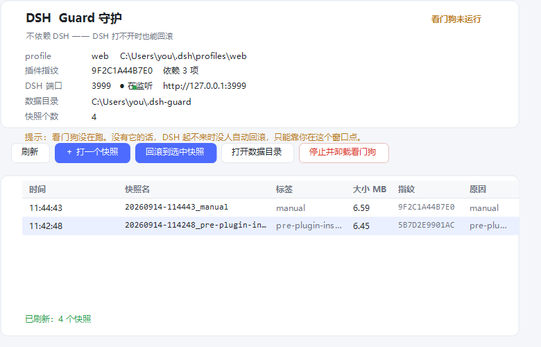

# DSH Guard · 守护

> 源码仓库：<https://github.com/stars-3/dsh-guard> ｜ npm：`dsh-guard-desktop`
> （作者的发布工具 `Push-ToGitHub.cmd` 留在本地、**不进公开仓库**）

给 [DeepSeek Harness](https://github.com/deepseek-ai) 用的 **profile 快照 / 崩溃自动回滚 / 一键主动回滚** 插件（Windows）。

> 一句话：**改插件、改配置之前先打一个快照；改崩了，一个按钮回滚回去。**
> 如果崩到连界面都打不开，还有一个活在 DSH 之外的看门狗替你回滚（默认不替你启动 DSH，见下）。

---

## 先说清楚一件事：插件救不了你，看门狗才行

这是本项目的核心设计，也是它为什么长成这个样子：

| 部件 | 活在哪 | 能干什么 | DSH 崩了还活着吗 |
|---|---|---|---|
| **守护面板** | DSH 插件（进程内） | 看状态、打快照、点回滚、装/卸看门狗 | ❌ 跟着一起死 |
| **看门狗** | Windows 计划任务（独立进程） | 巡检，**确认**起不来且近期动过插件 → 自动回滚 | ✅ 活着 |

所以「守护」不是一个纯插件：**插件只是它的遥控器**，真正能在 DSH 打不开的时候救你的是那个外挂看门狗。
（同类做法可参考 DSH-Store 在 macOS 上装的 launchd Guardian。）

---

## 它能做什么

- **打快照**：把 profile 的关键文件 + `node_modules` 一起镜像到一个带指纹的目录
- **插件变更检测**：比对 profile 指纹（依赖列表 + 关键文件哈希），发现变了就自动留一份变更后快照
- **一键主动回滚**：面板上每个快照都有「回滚到此快照」，两步确认，6 秒不点自动取消
- **自动回滚**（看门狗）：**只有"确认起不来"才回滚** —— 端口持续不在（超过宽限期 `DSHGUARD_RESTART_GRACE_SEC`）
  **且**日志里有致命错误证据（插件加载失败之类）**且**最近动过插件。三条同时成立才动手。
  > ⚠️ 2026-09-14 事故后收紧的：原来"端口不在 + 启动器进程没了"就算崩溃，而**这恰恰是重启的正常过程**
  > （先杀旧服务、再起新的），于是正常重启被判成崩溃 → 自动回滚 → 回滚又去拉同一个端口 → 撞端口
  > （EADDRINUSE）→ 服务再也起不来。现在**端口短暂不在从来不等于崩溃**。
  > 回归夹具：`tools\test-restart-collision.ps1`（复现该场景，4 个用例）。
- **回滚也留档**：回滚前先把当前（坏的）状态存一份 `pre-rollback-broken` —— 回滚本身也有后悔药
- **回滚后校验**：还原 → 移除新增插件目录 → `pnpm install` → **校验 profile 指纹是否真的回到快照值**，不通过就算失败

## 环境要求

- **Windows**（看门狗基于计划任务；`package.json` 里已声明 `os: ["win32"]`）
- DSH（`dsh` 命令可用），Node ≥ 20
- PowerShell 5.1（系统自带即可；`DSH_GUARD_POWERSHELL=pwsh.exe` 可切到 7）

---

## 安装

### 1. 装插件

双击 **`Install-Plugin.cmd`**（或在终端里跑 `Install-Plugin.ps1`）。

它会：
1. **先给你打一个 profile 快照**（装坏了能靠它回滚；不打快照就中止，除非加 `-NoSnapshot`）
2. 把插件拷到 `<你的 profile>\node_modules\dsh-guard`
3. 把 `dsh-guard` 登记进 profile 的 `dsh.profile.bundles`
4. 落地自检：JS 语法、`.ps1` 的 BOM、profile manifest 是否合法**且没有 BOM**；任何一项不过就**自动撤销这次安装**

然后**重启 DSH** 才会加载。

### 1b. 用 npm 上的版本（推荐，升级最省事）

```powershell
dsh plugin --profile desktop add dsh-guard-desktop
```

- **新增 bundle 会热加载**（约 18 秒，不用重启官方端）；只有"改了插件内部代码"才需要重启。
- ⚠️ 包名有两处契约（改一处漏一处 = **服务端全绿、界面全坏**，账本 **E80**）：
  ① `cordis.patch.yml` 的 `insert.name` **必须等于包名**（`dsh-guard-desktop`）—— DSH 只把
  bundle 包**按包名**链接进模块回退目录（写成旧名 → `/dsh-guard/*` 全 404、面板不挂载）；
  ② `client/client.js` 里 `window.__ModuleLoader__.load({ id })` **也必须等于包名** ——
  官方端按包名注册进客户端图并**断言**该 id 注册过（不一致 → `loaded without registering`）。
  版本：0.1.0 两处都错 → 0.1.1 修 ① → **0.1.2 修 ②**（现用 0.1.2）。
  自查：`DSH-Desktop\tools\Check-PluginPackaging.ps1 -Dir <本目录>`；
  profile 的 `cordis.patch.yml` 里那条覆盖用 `id: dsh-guard` 定位，**别写死 `name:`**，
  否则换包名时那条覆盖会被静默跳过（守护会退回默认 profile/判活方式）。

### 2. 打开面板

**设置 → 插件 → 守护**。

### 3. 装看门狗（这一步才是真正的保险）

看门狗是**跑在 DSH 之外**的那个进程 —— DSH 崩了、白屏了、起不来，它照样活着，负责自动回滚。

**两种自启方式，任选：**

| 方式 | 入口 | 需要管理员？ | 说明 |
|---|---|---|---|
| **计划任务**（默认） | 双击 `Install-Watchdog.cmd`，或在独立窗口里点「安装看门狗」 | 要（弹一次 UAC） | 注册名为 `DSH Guard 看门狗` 的计划任务：登录时启动、隐藏窗口、无时长上限、失败重试 3 次 |
| **启动文件夹** | 双击 `Install-Watchdog-NoAdmin.cmd` | **不要** | 在启动文件夹放一个快捷方式，登录时由资源管理器拉起。不想给管理员权限时用这个，效果一样 |

> 界面上点「安装看门狗」时：计划任务被拒或失败的话，它会**当场问你要不要改用启动文件夹方式**，
> 并把安装过程的完整输出弹给你看（同时写进 `<守护数据目录>\logs\guard-ui.log`）。

**端口不会被搞错**：安装时若没显式指定端口，它会自动探测"正在监听的 DSH 实例"并把那个端口烘进自启项
（而不是想当然地用 3080）。面板上也会显示它盯的是哪个端口、以及判定依据。

> ⚠️ **从哪一端装，就盯哪一端。** 看门狗会把"你点安装时所在的那个端口"烘进计划任务参数里。
> 你在哪个端口上点的安装，它就盯哪个端口。想换成另一个端口，在那个端口的面板里再装一次。

---

## 出事了怎么办

### 界面还能打开

面板上点「回滚到此快照」。建议选**在出问题之前**的那个（比如 `pre-plugin-install`）。

### 界面打不开了（白屏 / 起不来）

**推荐：双击独立窗口** —— 它**不依赖 DSH**，DSH 打不开时照样能回滚：

```
Open-Guard-UI.cmd
```



（外观照 DSH Web 做的：浅灰页面底 + 白色圆角卡片 + 品牌蓝。图是 `Guard-UI.ps1 -ProofSheet` 渲染出来的设计基准，
改配色后先渲染一张自己看，别拿用户的眼睛当测试机。）

想让它**带图标**出现在桌面上（`.cmd`/`.vbs` 自己不能带图标，只有快捷方式能）：

```
Create-Desktop-Shortcut.cmd
```

它建一个「DSH Guard 守护」快捷方式：目标 `wscript.exe` + `ui\Open-Guard-UI.vbs`（启动不闪控制台），
图标用本项目的 `ui\guard.ico`。

窗口里能做：看状态（profile / 插件指纹 / 端口在不在监听 / 看门狗 / 快照数）、列快照、
**选中一行 → 回滚到选中快照**（或直接双击那行）、打快照、打开数据目录、看日志、装/卸看门狗。

它**不写死任何端口**：判定顺序是 `-WebPort` > 环境变量 `DSH_WEB_URL` > **最近启动的那个 DSH 实例占用的端口** > 默认 3080；
判定依据会显示在窗口里，也可以手动改。

也可以在命令行做同样的事（同样不依赖 DSH）：

```powershell
# ① 直接卸载插件（删目录 + 从 bundles 摘掉），重启 DSH 即可
.\Uninstall-Plugin.cmd

# ② 或者用守护自己的命令行回滚到某个快照
powershell -ExecutionPolicy Bypass -File .\lib\guard.ps1 `
  -Action rollback -Profile web -Id 20260914-095206_pre-plugin-install -Out r.json
```

快照都在 `%USERPROFILE%\.dsh-guard\snapshots\`，直接看目录名也知道有哪些。
装过看门狗之后，`<守护数据目录>\bin\Guard-UI.ps1` 也会有一份 —— 即使插件目录被删了，它还在。

---

## 快照里存了什么

```
<profile>\package.json          <- profile 的依赖 + bundles 清单
<profile>\cordis.yml
<profile>\cordis.patch.yml      <- 你自己的补丁层
<profile>\pnpm-lock.yaml
<profile>\pnpm-workspace.yaml
<profile>\node_modules\         <- 整个镜像（含 pnpm 的 .pnpm 结构）
```

外加一份 `meta.json`：标签、时间、大小、`identity.hash`（profile 指纹）、`identity.depCount`、是否含 node_modules。

**指纹是什么**：profile 依赖集合 + 关键文件的哈希。它让"回滚成功了吗"变成可验证的事，
而不是"看起来文件回来了"。回滚流程最后一步就是拿它比对。

> 💾 **磁盘占用提醒**：因为镜像 `node_modules`，一个快照约等于你 profile 的 `node_modules` 大小。
> **不会无限涨**：打完一个快照就会自动清理，只保留最近 `DSHGUARD_KEEP_SNAPSHOTS` 个（默认 8，被标记为
> `lastGood` 的那个永不删）；而且**状态没变就不重复打**（判据是"标签相同 + 指纹相同"），
> 所以重启 DSH 不会每次都多出一份。
> 界面与命令行也都能手动清：独立窗口的「清理旧快照 / 删除选中」，面板上的「清理旧快照」，
> 以及 `guard.ps1 -Action prune [-Keep N]` / `guard.ps1 -Action delete -Id <快照名>`。

---

## 配置（环境变量）

看门狗是独立进程，配置靠**环境变量**（计划任务启动时继承的是系统/用户环境，不是 DSH 的）。

| 变量 | 默认 | 说明 |
|---|---|---|
| `DSHGUARD_HOME` | `%USERPROFILE%\.dsh-guard` | 守护自己的数据根目录（日志/快照/状态） |
| `DSHGUARD_WATCH_INTERVAL_SEC` | `5` | 巡检间隔（秒） |
| `DSHGUARD_QUARANTINE_SEC` | `90` | 检测到插件变更后的隔离观察期（秒） |
| `DSHGUARD_MAX_ROLLBACK_ATTEMPTS` | `3` | 连续回滚上限（防死循环） |
| `DSHGUARD_AUTO_START_DSH` | `0` | 端口持续不在且有致命证据时，是否擅自 `dsh web` 拉起 |
| `DSHGUARD_AUTO_RESTART` | `0` | 回滚后是否擅自拉起（同上） |
| `DSHGUARD_RESTART_GRACE_SEC` | `90` | 端口刚不在时的宽限期：这段时间只观察，不重启不回滚 |
| `DSHGUARD_KEEP_SNAPSHOTS` | `8` | 快照保留个数（超出的自动清理；lastGood 永不删） |
| `DSHGUARD_PLUGIN_CHANGE_WINDOW_SEC` | `900` | "最近动过插件"的时间窗（秒）：自动回滚只允许落在这个窗口内 |
> **为什么默认不替你启动 DSH**：看门狗只能用 `dsh web --port <端口>` 起一个**没有窗口**的实例；
> 而桌面外壳随后启动时，它的启动器会走"快速路径"看到端口已被占用，于是只去拉起"已有窗口" ——
> 可那个实例根本没有窗口，用户看到的现象就是**点图标打不开**。所以默认只记录 + 提示，由你自己启动。
| `DSH_GUARD_POWERSHELL` | `powershell.exe` | 用哪个 PowerShell 跑守护脚本 |

> ⚠️ 这张表里的名字**必须和 `lib/guard-bootstrap.ps1` 里的推导一致**。这里曾经踩过一个很隐蔽的坑：
> PowerShell 的 `-replace` **默认大小写不敏感**，所以 `([a-z0-9])([A-Z])` 会匹配几乎每两个字符，
> 生成 `DSHGUARD_W_AT_CH_IN_TE_RV_AL_SE_C` 这种名字 —— 于是**所有配置覆盖静默失效**（设了没用，还不报错）。
> 现在用 `-creplace`，并且有回归测试：
> `powershell -ExecutionPolicy Bypass -File tools\test-config.ps1`。

> 插件版**不做 AI 诊断**：桌面版那套依赖作者本机的 `ask.py`，不适合塞进插件。
> 脚本里 `Invoke-AiDiagnosis` 是一个返回"没诊断"的垫片，想接自己的诊断直接替换它。
> （所以也**没有** `DSHGUARD_ENABLE_AI` 这个变量 —— 别照桌面版文档去设。）

---

## 维护窗口：告诉守护"接下来别动我"

你要**重启 DSH / 改配置 / 换插件**时，可能会出现"端口短暂不在"，再叠加"最近动过插件"，
理论上仍有被判定成故障的余地。要绝对放心，就先声明一个维护窗口 —— 窗口内守护**只记录、
不重启、不回滚**：

```powershell
# 开一个 30 分钟的窗口（-Minutes 省略则默认 30）
lib\guard.ps1 -Action maint-start -Minutes 30 -Note '我在改配置' -Out r.json
# 提前结束
lib\guard.ps1 -Action maint-stop -Out r.json
```

窗口写成一个标记文件 `<守护数据目录>\state\maintenance.json`（内容是到期时间 + 备注），
**到期自动失效**，不会永久关掉守护。所以任何脚本/工具都能用它，不必依赖某套界面。

> 和 `DSHGUARD_RESTART_GRACE_SEC`（默认 90 秒）的区别：宽限期是**自动**的模糊判断
> （"刚还在跑 → 大概是有人在重启"），维护窗口是你**显式**声明的确定性保证。

## 目录结构

```
dsh-guard-plugin/
├─ package.json            dsh.bundle.patch + dsh.client（web, 注入 settings）
├─ cordis.patch.yml        insert: [{ id: dsh-guard, name: dsh-guard-desktop }] —— name 必须是包名（E80）
├─ Install-Plugin.ps1/.cmd 装（含装前快照 + 落地自检 + 失败自动撤销）
├─ Uninstall-Plugin.cmd    卸（= Install-Plugin.ps1 -Revert 的包装）
├─ client/client.js        设置页「守护」面板（React，两步确认回滚）
├─ Open-Guard-UI.cmd       打开独立窗口（不依赖 DSH）
├─ Create-Desktop-Shortcut.cmd  在桌面建带图标的快捷方式
├─ Install-Watchdog.cmd    装看门狗（计划任务，弹一次 UAC）
├─ Install-Watchdog-NoAdmin.cmd  装看门狗（启动文件夹，不需要管理员）
├─ ui/
│  ├─ Guard-UI.ps1         独立窗口本体（WinForms，照 DSH 观感自绘）
│  ├─ Open-Guard-UI.vbs    无控制台闪窗地拉起它（快捷方式指向它）
│  ├─ guard.ico            窗口/快捷方式图标（本项目自绘，非官方标志）
│  └─ theme-proof.png      界面设计基准（-ProofSheet 渲染出来的）
├─ lib/
│  ├─ index.js             宿主：7 条同源 HTTP 路由 + 端口解析
│  ├─ guard.ps1            CLI：status / list / snapshot / rollback / incidents
│  ├─ guard-bootstrap.ps1  配置头（所有目录 + 端口优先级）
│  ├─ guard-core.ps1       快照/回滚/健康/日志原语（25 个函数）
│  ├─ watchdog.ps1         看门狗入口（-Once 可只跑一轮）
│  ├─ watchdog-core.ps1    巡检/回滚/隔离循环（12 个函数）
│  ├─ install-watchdog.ps1 注册计划任务（自请求提权）
│  └─ uninstall-watchdog.ps1
└─ tools/                        开发/自检用，**不装进 profile**
   ├─ test-host-load.mjs         不启动 DSH，验宿主加载 + 路由 + 端口解析
   ├─ test-client-load.mjs       没有浏览器也验面板 bundle 能渲染出回滚按钮
   ├─ test-host-spawn.mjs        验宿主拼给 guard.ps1 的那套参数能拿到合法 JSON
   ├─ test-config.ps1            配置优先级 + DSHGUARD_* 环境变量覆盖
   ├─ test-cfg-keys.ps1          静态核对：核心引用的每个 $script:Cfg 键都有定义（防"判断静默失效"）
   ├─ test-restart-collision.ps1 回归夹具：复现"外壳重启被判成崩溃"那次事故，6 个用例
   └─ Fix-Bom.ps1                给 .ps1 补 UTF-8 BOM（5.1 会按 ANSI 读中文，缺 BOM 报假语法错）
```

---

## 自检与开发

```powershell
# 看装没装、bundles 有没有、JS/PS1 有没有问题（只读）
.\Install-Plugin.ps1 -Verify

# 宿主逻辑（不需要 DSH）——建议先指向影子环境，别碰真 profile
$env:DSH_HOME='D:\tmp\shadow\.dsh'; $env:DSHGUARD_HOME='D:\tmp\shadow\guardhome'
node tools\test-host-load.mjs

# 面板 bundle（不需要浏览器）
node tools\test-client-load.mjs

# 看门狗只跑一轮，把结果写成 JSON
powershell -File lib\watchdog.ps1 -Profile web -Once -Out r.json
```

**影子环境**（强烈建议）：用 `DSH_HOME` / `DSHGUARD_HOME` / `DSHGUARD_AUTO_RESTART=false` 把一切
重定向到临时目录，再用一个假的 `dsh.cmd` 顶替真命令 —— 这样连"回滚后自动重启"都能演练，
而不会动到你真正在用的 profile。

> ⚠️ 三条实测踩出来的坑，写在这里省你几个小时：
> 1. **DSH 会把 `DSH_WEB_URL` 导出给整个进程树**，第二个实例会继承第一个实例的端口。
>    所以守护的端口优先级是 **显式传参 > 请求的 Host 头 > `DSH_WEB_URL` > 3080**，
>    面板上也会显示"端口来自哪里"。猜错端口的症状是**看门狗以为 DSH 死了、反复重启**。
> 2. **DSH 读 profile 的 `package.json` 用 `JSON.parse`，不认 BOM。** 用
>    `Set-Content -Encoding UTF8`（5.1 会写 BOM）改它 = 整个 DSH 起不来。
> 3. 🔴 **客户端插件的 `inject` 是「服务名」，不是「包名」。**（这条是真把界面搞白过的）
>    `client/client.js` 里的 `exports.inject` 只能写 Cordis 服务名；写成
>    `['@deepseek-ai/dsh-client-ui-settings']` 这种包名，客户端插件就会去等一个**永远不存在
>    的服务** → 插件永不激活 → **客户端 boot 不完成、App 不挂载 → 界面全白**
>    （宿主和服务都正常、服务端日志一条错都没有，只剩 defer 注入的其他挂件可见 —— 极难定位）。
>    包名要放在 **`package.json` 的 `dsh.client.inject`**（那里是"先加载哪些插件"），
>    bundle 里只写服务名。本面板用 `ctx.slots` 挂设置页 Tab，所以是 `['slots']`
>    （对照：官方 `dsh-client-ui-settings-plugin-inventory` 写
>    `["slots","locale","remote","remote.pluginInventory"]`；本机已安装版本里有 44 个
>    官方客户端 bundle 都写 `inject = ["slots"]`）。
>    `Install-Plugin.ps1` 的落地自检与 `tools/test-client-load.mjs` 都会拦这条。
>    本项目一律用 `[IO.File]::WriteAllText(..., UTF8Encoding($false))`。

---

## 已知边界（不吹）

- **只支持 Windows**。看门狗依赖计划任务；macOS/Linux 需要换一套守护机制（欢迎 PR）。
- **一次只盯一个端口**。同时跑着多个 DSH 实例时，只有你安装时那一端被看门狗盯着。
- **看门狗在登录时启动**。它常驻，但如果它自己没起来（比如计划任务被禁用），就没人兜底 ——
  面板顶部的「看门狗运行中/未运行」徽章就是给你看这个的。
- **回滚 ≠ 万能**。它还原的是 profile 的配置与依赖；你自己项目里的文件、会话数据不在范围内。
- **不做云备份**。快照在本地 `~/.dsh-guard`，磁盘坏了就没了。

## 官方桌面端（`healthMode: process`，2026-09-26 新增）

DSH 官方桌面端（`D:\dsh\`）与网页端有两处硬差别，本插件为此增加了**进程模式**：

| 差别 | 后果 | 进程模式怎么解 |
|---|---|---|
| 界面端口**每次启动随机**（asar 里是 `server.listen(0, "127.0.0.1")`，实测过 19387） | 按端口判活必然盯错 | 判活改成看 `DeepSeek Harness.exe` 进程；结论写进**同一个** `$Health.PortUp` 字段，所以下游（宽限期/连续轮次阈值/隔离观察/回滚判定）**一行都没改** |
| 没有 `dsh web --port` 这条 CLI | 看门狗"自动拉起"用不了 | `Start-DshWeb` 改拉 `appExe`；HTTP 探测在进程模式下**跳过**（否则官方端一重启、端口一换就误报"HTTP 探测失败"） |
| 插件进程的 PATH 里没有 pnpm | 回滚最后一步 `pnpm install` 失败 | `$script:PnpmCmd` 指向官方端自带运行时（`node.exe <pnpm.cjs>`） |

装到官方端时**必须**在 profile 补丁层里给这段（不给就等于默认 `profile='web'` + 盯端口 = 守错对象）：

```yaml
- id: dsh-guard
  config:
    profile: desktop
    healthMode: process
    appExe: 'D:\dsh\DeepSeek Harness.exe'
    appProcess: 'DeepSeek Harness'
```

- **默认值是上游行为**：不传 `healthMode` 就是 `port` 模式，网页端那份**一个字节都没变**。
  夹具 `tools\test-process-mode.ps1` 把"进程模式可用"与"不配置 = 老行为"一起钉住（含阳性/阴性对照）。
- 顺带修掉一个会咬人的环境坑：**从 PowerShell 7 会话 spawn 出来的 5.1 子进程会继承 PS7 的
  `PSModulePath`** → 5.1 命中 PS7 版 `Microsoft.PowerShell.Utility`、加载失败 → `Get-FileHash`
  这类**靠自动加载**的 cmdlet 直接变成"无法识别的名称"。`lib/guard-bootstrap.ps1` §0 现在会剔掉 PS7 目录。
- 静态护栏：`tools\test-var-collision.ps1` —— dot-source 文件里的**普通变量**撞入口脚本的参数名
  （例如 `$keep` vs `[int]$Keep`：PowerShell 变量名不区分大小写 + dot-source 同作用域
  → 把数组赋给 [int] 参数，报一句**与变量名毫无关系**的 `Cannot convert System.Object[] to Int32`）。（带阳性对照自检）
- 看门狗脚本副本会同步到 `<守护数据目录>\bin`；`Install-Watchdog.cmd` 安装时会把
  `-HealthMode/-AppExe/-AppProcess` 一并**烘进计划任务参数**（登录时环境里什么都没有）。

## 许可

MIT，见 [LICENSE](LICENSE)。"DeepSeek"、"DeepSeek Harness" 是其权利人的商标，
本项目为第三方插件，不代表官方、也不暗示任何官方背书。
